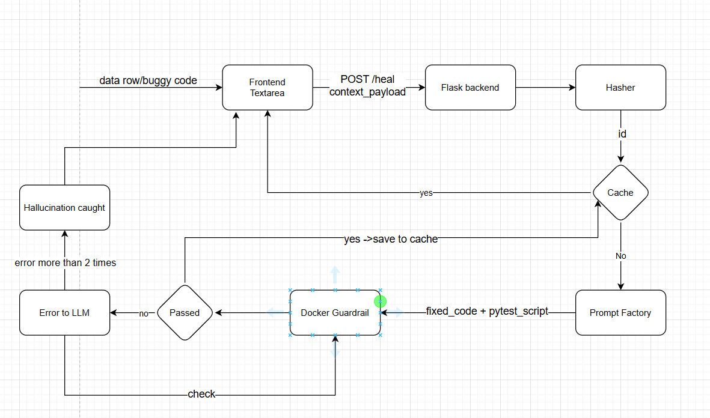

## Overview
This project addresses **AI Reliability** in automated code generation. While LLMs are proficient at generating fixes, they often produce "hallucinated" syntax or logically inconsistent code.

This system implements a **Deterministic Validation Loop**:
1. **Detection:** Identifies inconsistencies in input data.
2. **Generation:** AI engine proposes a fix.
3. **Sandboxing:** The fix is executed within a **Docker Sandbox** to run deterministic unit tests.
4. **Validation:** Only verified code is returned to the user; failed attempts trigger a re-generation or error log.
5. **Optimization:** Integrated **LRU Caching** stores verified fixes to minimize LLM latency and API costs.

## Architecture

## Demo
<video controls src="https://github.com/peach280/Self-Healing-Agent/raw/master/ProjectWalkthrough.mp4" width="100%">
  Your browser does not support the video tag.
</video>